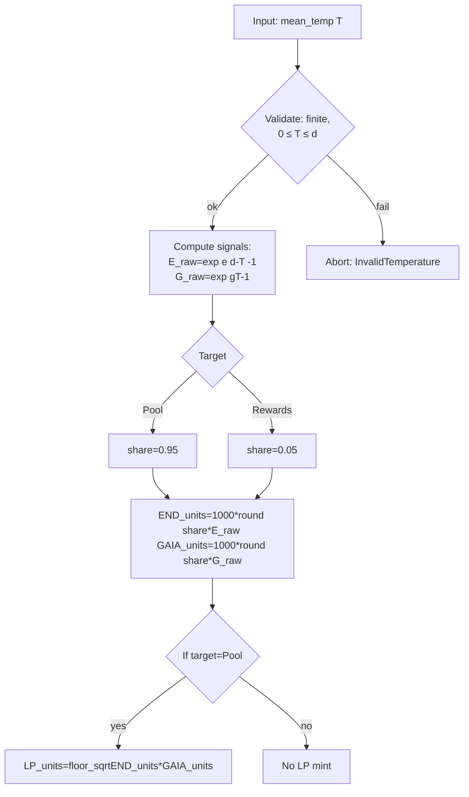
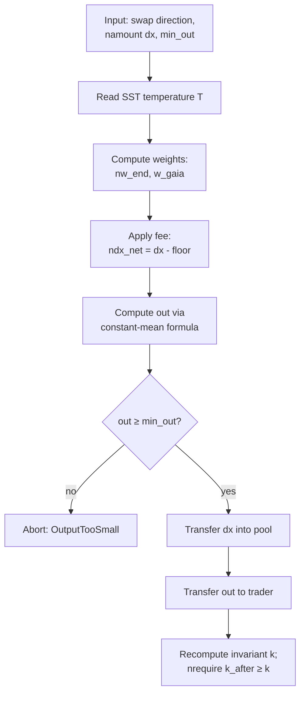

# Endcoin Program Math (Current Implementation)

This document describes the **math as implemented on-chain** in `endcoin/programs/endcoin/src/math.rs`.

## Definitions

- `T`: mean sea-surface temperature (°C)
- `d`: “death temperature” (°C), constant `DEATH_TEMP_C = 35.0`
- `e`: Endcoin rate constant, `END_RATE = 1.125`
- `g`: Gaiacoin rate constant, `GAIA_RATE = 0.75`
- Token base units: both mints use `decimals = 6` (1 token = 1,000,000 base units)

The program validates `T` with:

- `T` must be finite
- `0.0 ≤ T ≤ d`

## Emissions (Minting Schedule)

The system uses two temperature-driven “signal” functions:

- Endcoin signal:
  - `E_raw(T) = exp(e * (d - T) - 1)`
- Gaiacoin signal:
  - `G_raw(T) = exp(g * T - 1)`

Note: this is **not** `exp(x) - 1`; the `- 1` is inside the exponent to keep signals strictly positive across the valid temperature range.

### Targets: Pool vs Rewards

Emissions are split into two targets, each computed separately:

- Pool seeding: `share = 0.95`
- Rewards vault: `share = 0.05`

For a given `share`, each mint amount is computed as:

- `END_units(T, share)  = 1000 * round(share * E_raw(T))`
- `GAIA_units(T, share) = 1000 * round(share * G_raw(T))`

Where:

- `round(·)` is “round to nearest integer”
- the `* 1000` enforces **0.001 token granularity** (because 1000 base units at 6 decimals = 0.001 tokens)

### LP (Liquidity) Minting on Pool Deposits

When depositing liquidity, the program also mints LP tokens (PULSE) from the two minted amounts:

- `LP_units = floor_sqrt(END_units * GAIA_units)`

Where `floor_sqrt(n)` is the integer square root (largest integer `L` such that `L² ≤ n`).

### Emissions Flow (Mermaid)

## Temperature-Weighted AMM (Swap Math)

Swaps read temperature from the on-chain SST account (`sst.temperature`) and compute weights from the same underlying signals:

- `w_end(T)  = E_raw(T) / (E_raw(T) + G_raw(T))`
- `w_gaia(T) = G_raw(T) / (E_raw(T) + G_raw(T))`

These weights sum to 1 and smoothly shift from Endcoin-heavy at low `T` to Gaiacoin-heavy at high `T`.

### Crossover Temperature

With the current constants, the signals (and weights) are equal at:

- `T* = (e * d) / (e + g) = 21.0°C`

At `T = T*`, `E_raw(T) = G_raw(T)` and therefore `w_end(T) = w_gaia(T) = 0.5`.

### Invariant (Constant Mean)

With reserves `x` (END base units) and `y` (GAIA base units), the invariant is:

- `k = x^{w_end} * y^{w_gaia}`

The implementation evaluates this in log space:

- `ln(k) = w_end * ln(x) + w_gaia * ln(y)`

### Fees

Given input amount `dx` (base units) and fee in basis points `fee_bps`:

- `fee = floor(dx * fee_bps / 10_000)`
- `dx_net = dx - fee`

### Swap Output (Exact In, Min Out)

For reserves `r_in`, `r_out` and weights `w_in`, `w_out` corresponding to the input/output side:

- `out = floor( r_out * (1 - (r_in / (r_in + dx_net))^{(w_in / w_out)}) )`

When `w_in = w_out = 0.5`, this reduces to the familiar constant-product form:

- `out ≈ floor( r_out * dx_net / (r_in + dx_net) )`

### Swap Flow (Mermaid)

## Practical Notes / Edge Cases

- In the current program, `T` is supplied as an instruction argument for `deposit_liquidity` / `deposit_rewards`, while swaps use the on-chain `sst.temperature` value.
- Emissions can round to zero near extremes (very low `G_raw` or very low `E_raw` after applying `share`), and the deposit instructions reject “too small” deposits if any required amount is zero.
- `calculate_emissions` uses `u64` outputs and will fail if a temperature would imply an issuance larger than fits in `u64` after the `* 1000` scaling step (the program treats this as an arithmetic overflow).
